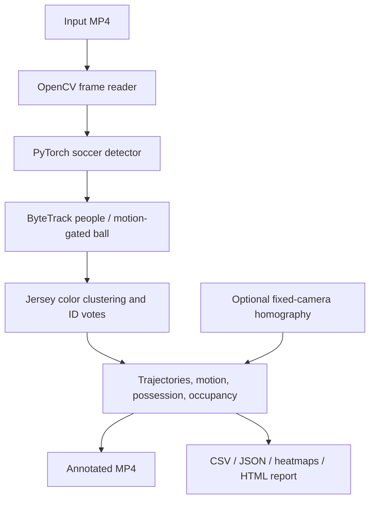

# SoccerVision

**AI-Powered Soccer Detection, Tracking & Analytics**

A Python/PyTorch/OpenCV pipeline that turns soccer video into annotated footage,
persistent object tracks, jersey-based team assignments, player trajectories,
possession estimates, occupancy heatmaps, and an interactive local report.

## Demo

The complete pipeline was run on a real **30-second, 750-frame, 1920×1080 soccer
clip at 25 FPS**. The generated video, GIF and report remain local:

- `outputs/videos/complete_match.mp4` — annotated video
- `outputs/complete_demo/report.html` — interactive player statistics and heatmaps
- `outputs/complete_demo/preview.gif` — five-second preview
- `outputs/complete_demo/tracks.csv` — observed tracks and foot trajectories

Download instructions below recreate the inputs. Generated footage, datasets and
model weights are excluded from Git. [Measured summaries](reports/latest/) are
committed so results can be reviewed without downloading large assets.

## Overview and features

- Four-class soccer detection: player, goalkeeper, referee and ball
- ByteTrack human identities, with a separate motion-based ball tracker
- Team classification from jersey colors, with temporal voting
- Observed trajectories and smoothed image-space speed/distance
- Ball-possession heuristic with explicit unknown frames
- Player/team heatmaps and interactive local HTML report
- Optional fixed-camera homography for meter-valued coordinates
- Reproducible dataset download, training, evaluation and threshold experiments
- CPU inference, automatic CUDA selection, and measured performance reports
- Validated configuration, logging, resource cleanup and deterministic tests

## Architecture



The readable frame loop lives in [pipeline.py](src/soccer_vision/pipeline.py).
See [the architecture guide](docs/architecture.md) for tensor shapes, coordinate
formats, association logic and explanations of the major implementation choices.

## Tech stack

Python 3.10+ (3.11 recommended), PyTorch, OpenCV, NumPy, Ultralytics 8.4.141,
LAP assignment, PyYAML and Matplotlib. Standard MOT metrics are an optional extra.
Ultralytics is pinned because its direct tracker API changes between releases.

## Installation

Run from the repository root in PowerShell:

```powershell
python -m venv .venv
.\.venv\Scripts\Activate.ps1
python -m pip install -r requirements.txt
```

If an existing environment has no pip, run `python -m ensurepip --upgrade`.
Select `.venv` as the interpreter in PyCharm. The implementation was tested on
Windows with Python 3.10.20, PyTorch 2.14.0+cpu and OpenCV 4.14.0. CUDA hardware
was unavailable; GPU selection is tested, but hardware execution is unverified.

## Usage

Download the documented public soccer checkpoint and example clip:

```powershell
python scripts/download_assets.py all
python scripts/run_video.py --input samples/input/match.mp4 --output outputs/videos/annotated_match.mp4
```

The default mode runs the complete pipeline with `models/checkpoints/best.pt`.
Artifacts are saved beside the video in `annotated_match_artifacts/`. Use a new
output filename/directory for each run. Asset downloads also reject overwrites;
request `model` or `video` separately if one already exists.

```powershell
python scripts/run_video.py --input samples/input/match.mp4 --output outputs/videos/custom.mp4 --config configs/default.yaml --artifacts outputs/custom --device cpu --max-frames 250
```

Options include `--model`, `--device`, `--image-size`, `--confidence`,
`--show-fps`/`--no-show-fps`, `--enable-tracking`, `--enable-team-classification`,
`--enable-possession`, and `--enable-heatmaps`. Each enable flag has a
`--no-enable-...` counterpart. Team possession and heatmaps depend on tracking;
disable dependent features together. YAML fields and defaults are in
[configs/default.yaml](configs/default.yaml). Paths are relative to the working
directory, so the examples assume the repository root.

Tracking requires `confidence <= track_low <= track_high` so weak detections
remain available for ByteTrack's second association pass. Generic detection and
unchanged frame processing remain available:

```powershell
python scripts/run_video.py --mode detect --input samples/input/match.mp4 --output outputs/videos/generic.mp4 --model yolo26n.pt --confidence 0.35
python scripts/run_video.py --mode copy --input samples/input/match.mp4 --output outputs/videos/copy.mp4
```

Generic pretrained YOLO26 labels people as `person`; it does not claim to
distinguish soccer roles. The downloaded soccer checkpoint supplies those labels.
MP4V encoding is lossy and omits audio. Some browsers cannot play MP4V directly;
use a desktop player for the MP4 and a browser for the HTML report/GIF.

## Dataset

The public [Football Game Object Detection Dataset mirror](https://huggingface.co/datasets/martinjolif/football-player-detection)
is attributed to its [Roboflow source](https://universe.roboflow.com/football-project-pifbc/football-players-detection-3zvbc-yyhdl)
and carries CC BY 4.0. The verified revision contains 298 training, 49 validation
and 25 test images. The label order is `ball, goalkeeper, player, referee`.

```powershell
python scripts/download_dataset.py
```

The script pins the resolved revision for all downloads, verifies image checksums,
saves a manifest and creates a machine-local YOLO YAML. [Dataset documentation](data/README.md)
and [reproduction commands](docs/reproduction.md) record the exact revision.
No API key is required. Exact cross-split image duplicates were not found, but
near-duplicate footage and overlap with the reference model's training data have
not been ruled out. These are in-domain results, not independent generalization.

## Model training

```powershell
python scripts/train_detector.py --config configs/training.yaml
```

The configuration controls pretrained checkpoint, epochs, batch size, image size,
learning rate, optimizer, device and seed. It defaults to a 50-epoch YOLO26 nano
run. The completed local experiment explicitly used **three CPU epochs**, not 50:

```powershell
python scripts/train_detector.py --epochs 3 --device cpu --name soccer_yolo26n_cpu3
```

That run produced `models/checkpoints/soccer_yolo26n_cpu3.pt`, actual training and
validation losses, mAP/precision/recall, and learning curves. Its test mAP@50 was
only **0.183**, compared with **0.815** for the downloaded soccer model, so it is
retained as an undertrained baseline rather than used by default. The default
[third-party YOLOv8x checkpoint](https://huggingface.co/gianpaj/football-players-detection-1)
was downloaded and evaluated here; its original training is not claimed as ours.
[Model provenance](models/README.md) distinguishes both checkpoints.

## Tracking

Separate ByteTrack instances track each human class. Public IDs survive ordinary
short occlusions and never get reused after a detected camera cut. The ball uses
a constant-velocity distance gate because small, fast-moving boxes often have no
IoU overlap. Gaps preserve association state briefly but emit no invented boxes.
Class changes, crossings, long occlusions and cuts can still fragment identities.

## Team classification

Upper-torso crops provide median color features after grass rejection. Two-means
clustering establishes anonymous teams; per-track votes stabilize assignments.
Lab is the default, with RGB and circular HSV available. Warm-up and ambiguous
crops stay unknown. Referees and goalkeepers are excluded from jersey clustering;
goalkeepers are not automatically assigned to an outfield team.

## Analytics and outputs

Each completed analysis run writes:

```text
annotated_match_artifacts/
  tracks.csv              # zero-based frames, IDs, classes, teams, boxes, feet
  possession.csv          # observed ball visibility and owner per frame
  player_stats.json       # smoothed pixel distance/speed; optional meter fields
  team_stats.json         # controlled/unknown frames and possession percentages
  benchmark.json          # actual latency, throughput, versions and counts
  config.json             # effective configuration
  status.json             # complete or failed, with processed frame count
  report.html             # interactive player statistics and heatmaps
  plots/                  # player and team image-coordinate heatmaps
```

Motion is measured between consecutive observations, with smoothing. Pixel
movement includes broadcast camera movement. Static homography is supported only
for an explicitly calibrated fixed camera; see [calibration instructions](docs/architecture.md#fixed-camera-calibration).
No physically accurate broadcast speed or distance is claimed. Heatmaps always
use image coordinates. Possession is nearest-player geometry, not event-level
ground truth; unknown frames are excluded from the team-percentage denominator.

## Evaluation

```powershell
python scripts/evaluate_detector.py --output outputs/evaluation_reference
```

Actual reference-model test results on **25 images / 599 annotated objects**:

| Class | Precision | Recall | mAP@50 | mAP@50:95 |
|---|---:|---:|---:|---:|
| Ball | 0.807 | 0.417 | 0.397 | 0.083 |
| Goalkeeper | 0.935 | 0.763 | 0.895 | 0.679 |
| Player | 0.973 | 0.972 | 0.982 | 0.768 |
| Referee | 0.970 | 0.964 | 0.987 | 0.649 |
| Overall | 0.921 | 0.779 | 0.815 | 0.545 |

See [the raw evaluation report](reports/latest/reference_evaluation.json).
The small test set and potential footage overlap limit interpretation.
Ball recall/localization are substantially weaker than human detection.

`scripts/evaluate_tracking.py` provides MOTA, IDF1 and identity-switch metrics
using `motmetrics` when fully annotated tracking CSV is supplied. Known-answer
tests verify it. No real tracking ground truth is available for the demo, so no
real MOTA/IDF1 result is claimed. [Instructions](docs/reproduction.md) explain the
required frame interval and annotation format.

## Experiments

```powershell
python scripts/experiment_confidence.py
```

The completed experiment compares thresholds 0.20–0.60 on all 49 validation
images using cached predictions and class-specific IoU matching. It reports
precision/recall, not mAP. [Measured results](reports/latest/confidence_experiment.json)
show the ball tradeoff: at 0.20, precision is 0.594 and recall 0.422; at 0.40,
precision rises to 0.720 while recall falls to 0.400. Changing confidence alone
cannot recover the missing ball detections.

## Performance

```powershell
python scripts/benchmark.py --input samples/input/match.mp4 --models models/checkpoints/best.pt models/checkpoints/soccer_yolo26n_cpu3.pt --frames 30
```

The benchmark compares identical initial video frames, excludes warm-up, and
records average/p50/p95 latency, inference FPS and available GPU memory. The
full-pipeline benchmark additionally includes decoding, tracking, annotations
and encoding. [Measured CPU comparison](reports/latest/inference_benchmark.json)
and [full demo measurements](reports/latest/demo_benchmark.json) contain the
actual values. A faster undertrained model is not an accuracy-preserving
optimization. No CPU-versus-GPU improvement is claimed.

The measured reference-model inference rate was **3.05 FPS** in the 30-frame
benchmark; the smaller undertrained model reached **48.15 FPS**. The complete
750-frame pipeline ran at **3.75 FPS**. [Result interpretation](reports/README.md)
explains the differing timing scopes and accuracy tradeoff.

## Tests

```powershell
python -m pip install -e ".[evaluation]"
python -m unittest discover -s tests -v
python -m pip check
```

Tests cover MP4 timing/content, failure handling, detection conversion, device
selection, track continuity, fast-ball gaps, jersey classification, geometry,
calibration, motion units, unknown possession, numeric serialization, MOT metrics
and the end-to-end artifact contract. Unit tests do not download model weights.
A Windows/Linux GitHub Actions workflow runs the same tests on Python 3.11.

## Project structure

```text
configs/                 pipeline and training configuration
src/soccer_vision/
  detection/             PyTorch adapter and normalized detections
  tracking/              ByteTrack human tracking and ball association
  teams/                 color features and team voting
  analytics/             geometry, calibration, motion, possession, heatmaps
  evaluation/            dataset validation and IoU matching
  video/                 validated streaming MP4 reader/writer
  visualization/         annotations, overlays, interactive report
  config.py              validated configuration dataclass
  pipeline.py            complete frame loop and exports
  cli.py                 command line entry point
scripts/                 downloads, training, evaluation, experiments, reporting
tests/                   deterministic unit and integration tests
docs/                    architecture and reproduction guide
reports/latest/          measured summaries and learning curves
```

## Limitations and future work

Ball misses, false detections, class confusion and ID fragmentation remain visible
failure cases. Team colors can fail on green/similar jerseys or lighting changes.
The scene-cut detector is a heuristic; identities do not represent players across
shots. MP4 output requires constant nominal FPS and even dimensions, loses audio,
and may leave partial artifacts on decoding failure (marked in `status.json`).

Further research includes longer fine-tuning, a genuinely independent match-level
test split, manual tracking ground truth, goalkeeper team rules, camera-motion
compensation, dynamic pitch calibration and optional ONNX/C++ benchmarks. These
are not claimed as implemented or measured.

## License and attribution

Project code is licensed under [AGPL-3.0](LICENSE). Ultralytics and the downloaded
soccer weights have their own AGPL-3.0 notices. The dataset is CC BY 4.0; example
video comes from the DFL footage linked by Roboflow's soccer example. Third-party
media is not relicensed by this code license. See [dataset attribution](data/README.md)
and [checkpoint provenance](models/README.md).
